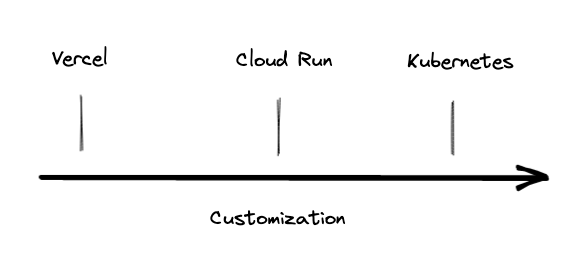

For my part, I quickly get confused with all those choices on where to deploy an app. I've heard a lot about Vercel (lambda), Container as a Service, Kubernetes, ... and want to clarify on when to use what.

# Hosting a Static Website

Hosting a static website is different than a complete web application.

# Hosting a Web App

## Hosting a Database

## Advanced Tooling

## Monitoring & Logging
